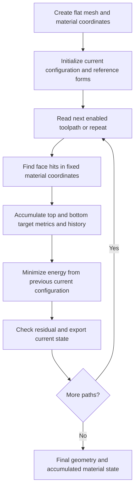

# How the bilayer zigzag simulation works

## 1. The essential correction: a flat plate does not have a zero metric

The simulation represents a **two-dimensional sheet embedded in three-dimensional space**. Every vertex has three coordinates, but the sheet has only two independent directions along its surface. That is why its metric and curvature forms are 2 × 2 matrices.

For an initially flat, stress-free plate:

- The vertex heights are zero: `z = 0`.
- The metric `a` is **nonzero**: it describes lengths and angles within each triangle.
- The curvature form `b` is zero.
- Initially, the top and bottom target metrics equal the metric of the flat mesh.
- The reference curvature is zero.

A zero metric would describe zero lengths in every surface direction and would be singular. It is not the metric of a flat plate. **Flat means no curvature, not no size.**

This guide describes the flat-start `zigzag_sequence` workflow used in our experiments. Other branches, curved reference geometries, and physical boundary conditions can change initialization. For JSON syntax and command options, see [the sequence reference](../README_ZigZag_Sequence.md).

## 2. What is actually stored?

Let `Nv`, `Nf`, and `Ne` denote the numbers of vertices, triangular faces, and mesh edges.

| Quantity | Conceptual format | Purpose |
|---|---|---|
| Current vertex positions `X` | `Nv × 3` real matrix | Current 3D shape |
| Face connectivity `F` | `Nf × 3` integer matrix | Three vertex indices for every triangle |
| Material coordinates `UV` | `Nv × 2` real matrix | Persistent location of each vertex on the original sheet |
| Edge-director variables `phi` | One scalar per edge | Additional shell orientation degrees of freedom used in curvature |
| Top target metrics `abar_top` | One symmetric 2 × 2 matrix per face | Preferred in-plane geometry of the top layer |
| Bottom target metrics `abar_bot` | One symmetric 2 × 2 matrix per face | Preferred in-plane geometry of the bottom layer |
| Reference curvature `bbar` | One symmetric 2 × 2 matrix per face | Reference second fundamental form |
| Hit history | Per-face counters and associated history | Tracks accumulated treatment and optional hardening |

There is **not one global 2 × 2 matrix for the whole plate**. Each triangle has its own forms.

### The actual configuration vector in memory

`DCSConfigurationData` stores `3*Nv + Ne` scalar values. The vertex matrix is an Eigen column-major view of this buffer; the director vector follows it:

```text
[ x0 ... x(Nv-1) | y0 ... y(Nv-1) | z0 ... z(Nv-1) | phi0 ... phi(Ne-1) ]
```

Thus `X(i,0)`, `X(i,1)`, and `X(i,2)` are the coordinates of vertex `i`, even though consecutive coordinates of that vertex are not adjacent in the underlying buffer. Topology and target forms are stored separately, not appended to this optimization vector.

Each `phi` is a scalar director angle, not an extra vertex or an independently stored three-component position. Together with neighboring face geometry it determines edge orientation information for bending. The ordinary flat initialization sets these director scalars to zero. Moving vertices while discarding the director state is not a faithful copy of the complete solved configuration.

### A small geometry example

A rectangular patch can have vertices, in metres,

```text
X = [ 0.000  0.000  0.000
      0.005  0.000  0.000
      0.000  0.005  0.000
      0.005  0.005  0.000 ]

F = [ 0  1  2
      1  3  2 ]
```

The first row of `F` means: connect vertices 0, 1, and 2 into a triangle. After deformation, the entries of `X` change, including the z-coordinates. The connectivity is retained in this workflow.

`UV` remains attached to the material. A vertex can move in 3D without changing its material coordinates. The toolpath uses `UV` to identify which part of the sheet is treated.

The top and bottom layers are not two independently moving surface meshes. They share the shell configuration, but have separate target metrics and layer contributions to elastic energy. Thickness is represented in the shell mechanics rather than by a stack of 3D solid elements.

## 3. Actual geometry versus preferred material geometry

The most important distinction is the bar over a symbol:

| Symbol | Meaning | What changes it? |
|---|---|---|
| `a(X)` | Actual first fundamental form: lengths and angles of the current surface | Moving vertices |
| `b(X, phi)` | Actual second fundamental form: discrete shell curvature | Moving vertices and changing directors |
| `abar_top`, `abar_bot` | Target/reference first fundamental forms | Prescribed growth updates |
| `bbar` | Reference second fundamental form | Initialization; retained by the metric-only sequence treatment |

An analogy: `abar` is the collection of preferred ruler measurements after permanent growth. `a` contains the ruler measurements that the current geometry actually realizes. A mismatch between them contributes elastic energy.

The target measurements of neighboring triangles do not necessarily fit together into one stress-free shape. The optimizer finds a compromise rather than guaranteeing `a = abar` everywhere.

### How can a 2 × 2 matrix describe a 3D surface?

Take two tangent vectors `t1` and `t2`, each containing three components. Their dot products form

```text
    [ t1·t1  t1·t2 ]
a = [               ].
    [ t2·t1  t2·t2 ]
```

The matrix has two rows because there are two surface directions, not because the tangent vectors are restricted to the xy-plane.

For orthogonal tangent vectors of length 5 mm, an illustrative metric is

```text
    [ 0.000025       0     ]
a = [                     ]  m².
    [     0       0.000025 ]
```

In orthonormal physical coordinates, the same flat geometry can instead have metric `I`. Matrix entries depend on the chosen coordinate basis. The implementation uses triangle-local edge-based forms, so a flat triangle generally does **not** have the identity matrix either.


For the first triangle in the vertex example, the code uses `e1 = v2-v1` and `e2 = v0-v2`. Its actual initial local metric is therefore

```text
     [ 0.000050  -0.000025 ]
a0 = [                     ]  m²,
     [-0.000025   0.000025 ]

b0 = [ 0  0 ]
     [ 0  0 ].
```

The nonzero off-diagonal entries encode the angle between these chosen edge vectors. They are not an error or evidence of initial growth.
The actual `b` is computed with the discrete shell's director information; it is not obtained by declaring every planar rendered triangle to have zero curvature. The shape operator is `S = inverse(a) b`, with mean curvature `H = trace(S)/2` and Gaussian curvature `K = det(S)`. These are computed per face. Raw face-valued plots therefore look triangular.

See [ExtendedTriangleInfo.hpp](../src/libshell/ExtendedTriangleInfo.hpp) and [ComputeCurvatures.cpp](../src/libshell/ComputeCurvatures.cpp).

## 4. What applying eigenstrain means here

Growth is a prescribed change in the preferred metric. It is not a force pushing a vertex upward, and the algorithm does not directly assign a dome or cylinder height.

For each face hit, the sequence forms directional growth increments from the layer growth and orthotropy inputs:

```text
g1_top = q * gtop * (1 + ortho)
g2_top = q * gtop * (1 - ortho)
g1_bot = q * gbot * (1 + ortho)
g2_bot = q * gbot * (1 - ortho)
```

Here `q` represents the history-dependent growth effectiveness; it is one when hardening is disabled. A nonuniform along-path profile can modify the top growth before these increments are applied.

- `ortho = 0`: equal growth in the two local in-plane directions.
- `ortho = 1`: the second directional increment is zero.
- Rotating a path with `ortho = 0` changes its spatial coverage, but does not turn the local isotropic increment into a uniaxial one.

For isotropic growth `g`, a length is multiplied by `1+g`, so its squared length is multiplied by `(1+g)^2`. At `g = 0.00012`, that metric multiplier is `1.0002400144`. The example metric diagonal above becomes `0.00002500600036 m²` after one such increment.

The multiplicative implementation performs a basis-aware congruence update of the existing target metric, rather than simply adding `g` to every matrix entry. See [GrowthHelper.hpp](../src/libshell/GrowthHelper.hpp), `updateAbarWithMaterialGrowthIncrement`.

More explicitly, for each layer and face:

```text
R = rotation by the material growth angle
L = diag(1+g1, 1+g2)
G = R L transpose(R)
Dm = [material edge e1, material edge e2]
T = inverse(Dm) G Dm
abar_new = transpose(T) abar_old T
```

This is the `multiplicative` mode used in the recent diagnostics. `Dm` expresses the fixed material triangle basis; it is not rebuilt from the newly deformed 3D vertex positions.

For a path containing overlapping strips, a face can receive multiple increments. Consequently, **120 microstrain per hit is not necessarily 120 microstrain accumulated at that face**.

## 5. Why top-only growth can bend the sheet

The top and bottom layers share one shell geometry. If their preferred in-plane lengths differ, the sheet can partially accommodate the difference by bending: one side of a bent sheet is longer than the other.

For otherwise symmetric layers, a useful conceptual decomposition is:

```text
Average layer growth       → membrane stretching drive
Top-minus-bottom growth    → bending mismatch drive
```

This is a physical interpretation, not a replacement for the implemented energy formula. The bilayer operator includes stretching, bending, and stretch–bend coupling terms.

- `gtop > 0`, `gbot = 0`: both membrane growth and a bending mismatch.
- `gtop = gbot > 0`, with matching profiles and identical initial layer metrics: symmetric growth without an added layer mismatch. Localized growth can still generate stress and buckle.
- A zero reference `bbar` does **not** prevent mismatch-driven bending.

The simulations are not a direct English-wheel contact model. Different tool curvatures do not uniquely specify `gtop` and `gbot`. The correspondence between real plastic deformation and prescribed layer growth requires physical calibration.

## 6. One complete recurring simulation



### Initialization

The flat mesh supplies the nonzero initial target metrics. Its reference curvature is zero. Current and reference configurations initially describe the same stress-free geometry.

### Select the material to treat

The zigzag centerline, width, center, and rotation define a footprint in `UV`. Face membership is determined using material-space face centroids. This is why narrow strip boundaries can look staircase-like on a coarse mesh.

### Apply the load increment

Each hit updates the corresponding top/bottom target metrics. The accumulated target state is retained between paths. The shared reference curvature is not rewritten.

### Solve for a new configuration

The optimizer changes the vertex and director degrees of freedom to reduce elastic energy while the target forms are held fixed. Actual `a` and `b` are recomputed as the configuration changes.

For our non-adaptive diagnostic runs, the full path's increments are applied before its equilibrium solve. This is not a moving roller contact simulation with a solve at every infinitesimal point of the centerline.

### Continue

The next path begins with the previous solved geometry and its director state. It also inherits the accumulated target metrics and treatment history. Merely advancing to the next path does not erase the previous elastic mismatch.

The sequence implementation is in [Sim_Bilayer_Growth.cpp](../src/simulations/Sim_Bilayer_Growth.cpp), under `growth_type == "zigzag_sequence"`.

## 7. What the optimizer does—and does not do

The optimizer searches over shell configuration variables. It does not optimize the input path or the prescribed growth magnitude in these forward runs.

It repeatedly evaluates the bilayer energy and its gradient, updates the state, and terminates according to its stopping conditions. Numerical rigid-body constraints can remove unconstrained translations/rotations; those should not be confused with physical tool contact or clamping.

A small gradient means the configuration is approximately stationary under the chosen constraints. It does not prove:

- a unique solution;
- a global minimum;
- stability against all perturbations;
- mesh convergence;
- agreement with an actual English-wheel experiment.

These distinctions matter when a flat symmetric configuration or a strongly directional bending configuration persists.

## 8. What “warm start” means in our discussion

### Continuation within one process

We mean that path 2 starts its equilibrium solve from the configuration found after path 1. No geometry import is needed because the mesh and material state already exist in memory.

### Restarting a different process from saved geometry

This is a different operation. A geometry file alone is not the complete mechanical state. A faithful restart needs the appropriate topology, current vertex/director state, target/reference forms, material coordinates, boundary conditions, material parameters, and relevant history.

Do not assume that importing an STL, or merely assigning vertex positions from a VTP, reconstructs all of these. Optional internal state output exists, but the loader and history restoration must be checked before calling it a complete recurring restart.

### What would be a stress-free reset?

Replacing the target/reference forms with the actual forms of the just-deformed shape would redefine what the material considers stress-free. That is **not** what the recurring metric-growth workflow does.

A concise description to use with Putong is:

> We continue within one recurring simulation. After each path, we retain the solved vertex/director configuration and accumulated top/bottom target metrics, add the next growth increment, and minimize again. We do not redefine the deformed configuration as a new stress-free reference.

## 9. Why order can matter

There are two separate mechanisms:

1. **Different final material state:** general directional multiplicative updates or history-dependent growth can produce different final target metrics when reordered. Isotropic updates are an important commuting special case.
2. **Different solution selection:** even with the same final target metrics, a local optimizer can follow different configurations through the intermediate loads.

Therefore, minimizing after every path does not imply order independence. Compare final target metrics before attributing a shape difference solely to solution selection.

Our [order-progression figure](../run/forward_model_diagnostics/toolpath_order_progression.png) illustrates the numerical observation. The [quantitative comparison](../run/forward_model_diagnostics/toolpath_order_effect.json) records approximately equal final target metrics and different final shapes. This is evidence for the tested runs, not proof of stable physical branches.

## 10. How to read the output files

| Output | What it tells you |
|---|---|
| `sequence.json` | Prescribed path geometry, order, growth, and hardening settings |
| `manifest.json` | Runner-recorded command, binary identity, and case settings |
| `*_mapping.vtp` | Which faces each path hits; material coordinates and directional mapping |
| `*_final.vtp` | Current shape after that cycle; accumulated target metrics and diagnostic fields |
| `sequence_convergence.csv` | Current implementation's solve attempts, residuals, and acceptance |
| `*_summary.csv` | Per-cycle energy and treatment summaries |
| `result.json` | Runner-recorded completion and solver evidence |

Useful field names include `material_u`, `material_v`, `U_from_cycle0`, `abar_top_11`, `abar_top_12`, `abar_top_22`, the corresponding bottom fields, `bbar_ref_*`, `gauss`, and `mean`.

Raw displacement `U_from_cycle0` can contain rigid motion. Our comparison plots remove rigid translation and rotation before showing height or reporting shape-difference RMS. A height color map is a top-down display of 3D displacement, not a change to a 2D simulation.

## 11. The workflow in one sentence

**Start with a 3D shell configuration of a flat sheet; change the preferred in-plane metrics on material-space toolpath footprints; minimize the bilayer energy by moving vertices and directors; retain both the solved configuration and accumulated material state for the next path.**

## Source map

- [ConfigurationData.hpp](../src/libshell/ConfigurationData.hpp): configuration storage and vertex/director accessors.
- [DCSCurrentConfigurationData.hpp](../src/libshell/DCSCurrentConfigurationData.hpp): current geometric data.
- [DCSConfigurations.hpp](../src/libshell/DCSConfigurations.hpp): reference and current configuration classes.
- [Mesh.hpp](../src/libshell/Mesh.hpp): topology/configuration ownership and initialization.
- [ExtendedTriangleInfo.hpp](../src/libshell/ExtendedTriangleInfo.hpp): actual first/second fundamental forms.
- [ComputeCurvatures.cpp](../src/libshell/ComputeCurvatures.cpp): per-face mean and Gaussian curvature.
- [GrowthHelper.hpp](../src/libshell/GrowthHelper.hpp): target-metric growth updates.
- [ZigZagGrowth.hpp](../src/libshell/ZigZagGrowth.hpp): strip geometry and material-coordinate hit selection.
- [EnergyHelper_Parametric.hpp](../src/libshell/EnergyHelper_Parametric.hpp): shell energy ingredients.
- [Sim_Bilayer_Growth.cpp](../src/simulations/Sim_Bilayer_Growth.cpp): forward simulation and recurring loop.
