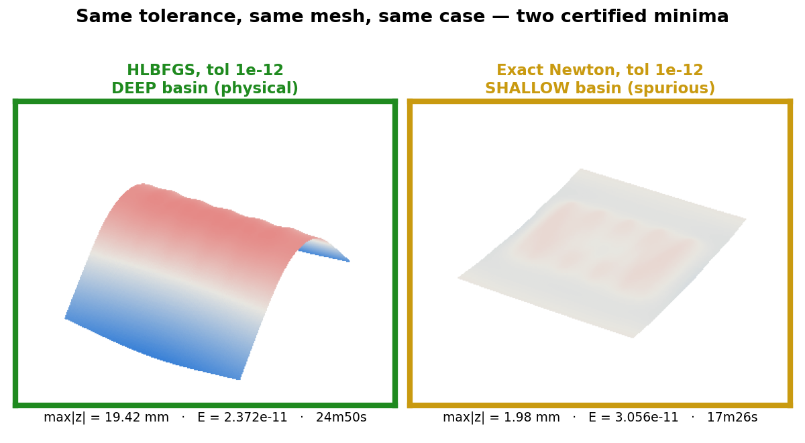
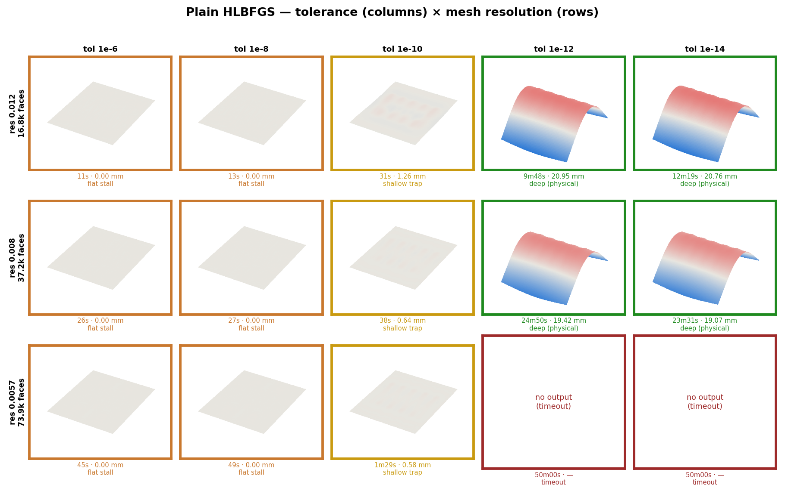
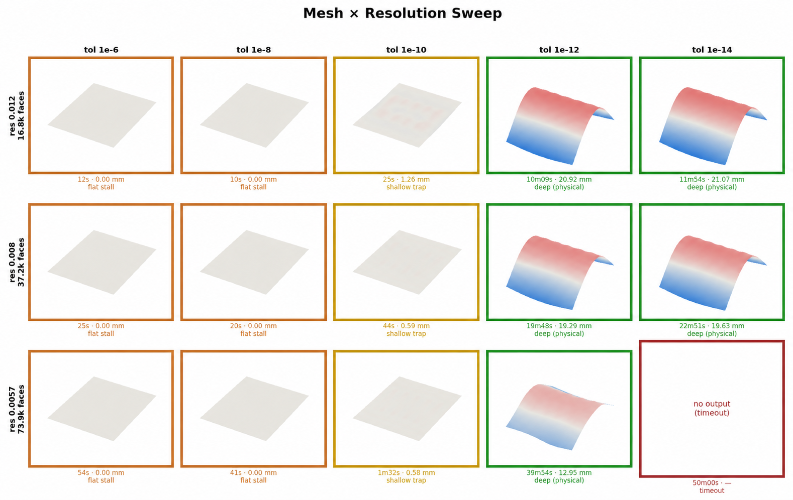
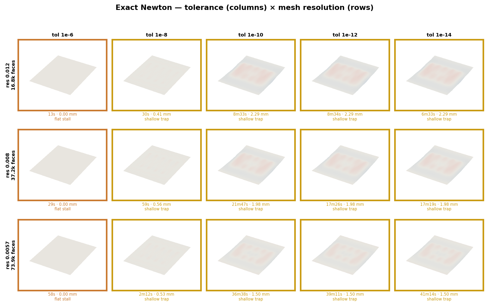

# Zigzag Bilayer Solver: Tolerance × Mesh × Algorithm Sensitivity

**Date:** 2026-08-19
**Branch:** `wip/exact-hessian-certification`
**Job:** SLURM array 9924300 (45 tasks, 10-wide concurrency)
**Script:** `scripts/sensitivity_sweep.sbatch`

> Historical note (2026-08-21): Newton-family optimizers were removed from the
> production code after this study showed that they select the wrong physical
> basin. The numerical results below are retained as decision evidence. The
> current sensitivity launcher runs only plain and exact-Hessian-certified
> HLBFGS.

## 1. Objective

Determine how the final deformed shape and its cost (wall time) depend on three
solver settings, for the **physical english-wheel regime** (small, single-pass
growth, Putong-parity geometry): solver **tolerance**, mesh **resolution**, and
**minimization algorithm**. The result revises an earlier recommendation to
switch the physical-regime pipeline to exact Newton for speed — the sweep shows
that change would silently pick the wrong equilibrium.

## 2. Method

**Case (fixed across all 45 runs):** `putong_1step.json` — Putong's exact
english-wheel recipe: rectangular panel 127 × 152.4 mm, `h_total` = 0.6 mm,
zigzag pattern `lv` 140 mm / `alpha` 9.13° / `N` 10 strips / `w` 10 mm, single
growth step `gtop` = 0.003 (0.3% top-layer eigenstrain, one wheel pass).

**Factors swept (5 × 3 × 3 = 45 runs):**

| Factor | Levels |
|---|---|
| Tolerance (`-tol`) | 1e-6, 1e-8, 1e-10, 1e-12, 1e-14 |
| Mesh resolution (`-res`) | 0.012 (16.8k faces), 0.008 (37.2k faces), 0.0057 (73.9k faces) |
| Algorithm | Plain HLBFGS · HLBFGS + seeded exact-Hessian escape ("certified") · Exact Newton (`newton_exact`) |

Every run is post-certified (`-certify_final true`) via the exact TinyAD
Hessian, so a uniform stability verdict (λmin, "minimum" vs
"saddle") is available even for plain HLBFGS. Wall time is `date`-based,
measured around the solver invocation and logged as the last field of each
result record. Each run capped at 3000 s (50 min); 3 fine-mesh/tight-tolerance
HLBFGS-family runs hit this cap and produced no output.

**Rendering:** the final deformed surface of every completed run is drawn on
one shared vertical/color scale (± 21.1 mm — the global maximum deflection
across all 45 runs), so flat, shallow, and deep outcomes are visually
comparable across the whole sweep, not auto-scaled per panel.

## 3. Headline result

The three algorithms do not merely differ in speed — at tight, converged
tolerance they converge to **two different certified minima** of the same
problem:

- **HLBFGS** (both plain and with escape) grinds through the flat plateau and
  settles into a **deep** basin: max|z| ≈ 19–21 mm, lower energy
  (E ≈ 2.37–2.40×10⁻¹¹), stable as the mesh refines.
- **Cold-start exact Newton** converges — identically across tol 1e-10/1e-12/1e-14,
  i.e. a true fixed point, not under-convergence — into a **shallow** basin:
  max|z| ≈ 1.5–2.3 mm, higher energy (E ≈ 3.06–3.11×10⁻¹¹), and this basin's
  deflection *shrinks toward flat* as the mesh is refined (2.29 → 1.98 → 1.50 mm
  across res 0.012 → 0.008 → 0.0057). That mesh-dependence is the signature of a
  spurious near-flat trap, not a converged physical shape.
- Both are certified stable minima (λmin > 0 in every case) — the
  certificate confirms *a* minimum, not *the* physical one. Four independent
  continuation runs from earlier work (Putong's single-step recipe, uniform ×10
  continuation, and 30-step trajectory continuation, all via HLBFGS) agree with
  the **deep** basin, corroborating it as the physical answer.

## 4. Per-algorithm grids

Columns tighten tolerance left→right; rows refine mesh top→bottom. Caption
under each panel: wall time · max|z| · outcome class.

### Plain HLBFGS

Flat below tol 1e-10 (max|z| ≈ 0), a shallow intermediate state at 1e-10, and
the deep physical shape only from 1e-12 on. Cost at 1e-12 rises sharply with
mesh: 588 s → 1490 s → **timeout** (>3000 s) across the three resolutions.

### HLBFGS + seeded exact-Hessian escape ("certified")

Tracks plain HLBFGS almost exactly at every setting — there is no negative
curvature to escape from in this single-pass physical regime, so the escape
machinery adds negligible cost or benefit here (its value is in the
large-growth, multistable regime studied separately). The finest-mesh,
tightest-tolerance cell (res 0.0057, tol 1e-12) is the one case that completed
where plain HLBFGS timed out (2394 s), reaching the deep basin.

### Exact Newton

Tolerance-invariant from 1e-10 downward at every mesh (bit-identical results
across 1e-10/1e-12/1e-14) — a genuine fixed point, reached faster than HLBFGS
at every setting, and the only algorithm to finish the finest mesh at tight
tolerance. But every converged cell lands in the shallow basin, and the
shallow basin's deflection shrinks with mesh refinement (see §3).

## 5. Full results table

`alg` · `res` (m) · `tol` · `faces` · `E` (energy) · `max|z|` (m) ·
`Σ|H|dA` (curvature) · `λ_min` · `wall` (s) · `verdict`

| alg | res | tol | faces | E | max\|z\| | Σ\|H\|dA | λ_min | wall | verdict |
|---|---|---|---|---|---|---|---|---|---|
| hlbfgs | 0.012 | 1e-6 | 16800 | 7.170e-11 | 5.11e-07 | 4.075e-04 | +3.58e-08 | 11s | minimum (flat) |
| hlbfgs | 0.012 | 1e-8 | 16800 | 7.170e-11 | 5.11e-07 | 4.075e-04 | +3.58e-08 | 13s | minimum (flat) |
| hlbfgs | 0.012 | 1e-10 | 16800 | 3.523e-11 | 1.259e-03 | 1.021e-01 | +3.67e-08 | 31s | minimum (shallow) |
| hlbfgs | 0.012 | 1e-12 | 16800 | 2.404e-11 | 2.095e-02 | 9.427e-02 | +3.67e-08 | 588s | minimum (deep) |
| hlbfgs | 0.012 | 1e-14 | 16800 | 2.404e-11 | 2.076e-02 | 9.427e-02 | +3.67e-08 | 739s | minimum (deep) |
| hlbfgs | 0.008 | 1e-6 | 37200 | 7.297e-11 | 6.27e-07 | 7.693e-04 | +2.40e-08 | 26s | minimum (flat) |
| hlbfgs | 0.008 | 1e-8 | 37200 | 7.297e-11 | 6.27e-07 | 7.693e-04 | +2.40e-08 | 27s | minimum (flat) |
| hlbfgs | 0.008 | 1e-10 | 37200 | 3.643e-11 | 6.40e-04 | 9.531e-02 | +2.42e-08 | 38s | minimum (shallow) |
| hlbfgs | 0.008 | 1e-12 | 37200 | 2.372e-11 | 1.942e-02 | 9.442e-02 | +2.42e-08 | 1490s | minimum (deep) |
| hlbfgs | 0.008 | 1e-14 | 37200 | 2.374e-11 | 1.907e-02 | 9.426e-02 | +2.42e-08 | 1411s | minimum (deep) |
| hlbfgs | 0.0057 | 1e-6 | 73920 | 7.381e-11 | 5.81e-07 | 8.913e-04 | +1.61e-08 | 45s | minimum (flat) |
| hlbfgs | 0.0057 | 1e-8 | 73920 | 7.381e-11 | 5.81e-07 | 8.913e-04 | +1.61e-08 | 49s | minimum (flat) |
| hlbfgs | 0.0057 | 1e-10 | 73920 | 3.663e-11 | 5.84e-04 | 9.337e-02 | +1.62e-08 | 89s | minimum (shallow) |
| hlbfgs | 0.0057 | 1e-12 | — | — | — | — | — | 3000s | **TIMEOUT** |
| hlbfgs | 0.0057 | 1e-14 | — | — | — | — | — | 3000s | **TIMEOUT** |
| certified | 0.012 | 1e-6 | 16800 | 7.170e-11 | 5.11e-07 | 4.075e-04 | +3.58e-08 | 12s | minimum (flat) |
| certified | 0.012 | 1e-8 | 16800 | 7.170e-11 | 5.11e-07 | 4.075e-04 | +3.58e-08 | 10s | minimum (flat) |
| certified | 0.012 | 1e-10 | 16800 | 3.476e-11 | 1.261e-03 | 9.627e-02 | +3.67e-08 | 25s | minimum (shallow) |
| certified | 0.012 | 1e-12 | 16800 | 2.404e-11 | 2.092e-02 | 9.426e-02 | +3.67e-08 | 609s | minimum (deep) |
| certified | 0.012 | 1e-14 | 16800 | 2.404e-11 | 2.107e-02 | 9.429e-02 | +3.67e-08 | 714s | minimum (deep) |
| certified | 0.008 | 1e-6 | 37200 | 7.297e-11 | 6.27e-07 | 7.693e-04 | +2.40e-08 | 25s | minimum (flat) |
| certified | 0.008 | 1e-8 | 37200 | 7.297e-11 | 6.27e-07 | 7.693e-04 | +2.40e-08 | 20s | minimum (flat) |
| certified | 0.008 | 1e-10 | 37200 | 3.664e-11 | 5.93e-04 | 9.166e-02 | +2.42e-08 | 44s | minimum (shallow) |
| certified | 0.008 | 1e-12 | 37200 | 2.372e-11 | 1.929e-02 | 9.424e-02 | +2.42e-08 | 1188s | minimum (deep) |
| certified | 0.008 | 1e-14 | 37200 | 2.370e-11 | 1.963e-02 | 9.408e-02 | +2.42e-08 | 1371s | minimum (deep) |
| certified | 0.0057 | 1e-6 | 73920 | 7.381e-11 | 5.81e-07 | 8.913e-04 | +1.61e-08 | 54s | minimum (flat) |
| certified | 0.0057 | 1e-8 | 73920 | 7.381e-11 | 5.81e-07 | 8.913e-04 | +1.61e-08 | 41s | minimum (flat) |
| certified | 0.0057 | 1e-10 | 73920 | 3.681e-11 | 5.76e-04 | 9.237e-02 | +1.61e-08 | 92s | minimum (shallow) |
| certified | 0.0057 | 1e-12 | 73920 | 2.496e-11 | 1.295e-02 | 9.740e-02 | +1.61e-08 | 2394s | minimum (deep) |
| certified | 0.0057 | 1e-14 | — | — | — | — | — | 3000s | **TIMEOUT** |
| newton | 0.012 | 1e-6 | 16800 | 7.758e-11 | 0.00e+00 | 0.000e+00 | +3.57e-08 | 13s | minimum (flat) |
| newton | 0.012 | 1e-8 | 16800 | 4.020e-11 | 4.10e-04 | 6.534e-02 | +3.66e-08 | 30s | minimum (shallow) |
| newton | 0.012 | 1e-10 | 16800 | 3.105e-11 | 2.288e-03 | 9.977e-02 | +3.67e-08 | 513s | minimum (shallow) |
| newton | 0.012 | 1e-12 | 16800 | 3.105e-11 | 2.288e-03 | 9.977e-02 | +3.67e-08 | 514s | minimum (shallow) |
| newton | 0.012 | 1e-14 | 16800 | 3.105e-11 | 2.288e-03 | 9.977e-02 | +3.67e-08 | 393s | minimum (shallow) |
| newton | 0.008 | 1e-6 | 37200 | 7.694e-11 | 0.00e+00 | 0.000e+00 | +2.39e-08 | 29s | minimum (flat) |
| newton | 0.008 | 1e-8 | 37200 | 3.810e-11 | 5.61e-04 | 8.137e-02 | +2.42e-08 | 59s | minimum (shallow) |
| newton | 0.008 | 1e-10 | 37200 | 3.056e-11 | 1.980e-03 | 1.021e-01 | +2.42e-08 | 1307s | minimum (shallow) |
| newton | 0.008 | 1e-12 | 37200 | 3.056e-11 | 1.980e-03 | 1.021e-01 | +2.42e-08 | 1046s | minimum (shallow) |
| newton | 0.008 | 1e-14 | 37200 | 3.056e-11 | 1.980e-03 | 1.021e-01 | +2.42e-08 | 1039s | minimum (shallow) |
| newton | 0.0057 | 1e-6 | 73920 | 7.675e-11 | 0.00e+00 | 0.000e+00 | +1.61e-08 | 58s | minimum (flat) |
| newton | 0.0057 | 1e-8 | 73920 | 3.645e-11 | 5.26e-04 | 8.576e-02 | +1.62e-08 | 132s | minimum (shallow) |
| newton | 0.0057 | 1e-10 | 73920 | 3.093e-11 | 1.503e-03 | 9.935e-02 | +1.62e-08 | 2198s | minimum (shallow) |
| newton | 0.0057 | 1e-12 | 73920 | 3.093e-11 | 1.503e-03 | 9.935e-02 | +1.62e-08 | 2351s | minimum (shallow) |
| newton | 0.0057 | 1e-14 | 73920 | 3.093e-11 | 1.503e-03 | 9.935e-02 | +1.62e-08 | 2474s | minimum (shallow) |

Raw tab-separated data: `run/sensitivity/sensitivity_table.txt` (gitignored,
regenerable from the SLURM array). Per-run logs and STL/VTP outputs under
`run/sensitivity/a-<alg>_r<res>_t<tol>/`.

## 6. Findings

1. **Tolerance is a cliff, not a dial.** For HLBFGS, tol 1e-6 and 1e-8 return
   an identical flat plate (max|z| ≈ 5–6×10⁻⁷ m) — the growth-driven gradient
   toward the buckled shape sits below those tolerances, so the solve
   terminates on the flat state at essentially zero cost. That flat state is a
   genuine local minimum (λmin > 0), so **certification does not
   catch it** — only the magnitude of the deflection does. The physical shape
   only appears at tol 1e-12 and costs 45–130× more than the flat "solve."

2. **Algorithm changes the answer, not only the speed.** This is the main
   revision from earlier analysis, which recommended switching to exact Newton
   in the physical regime for speed. The sweep shows cold-start Newton is
   faster and tolerance-robust, but converges to a **different, shallower,
   higher-energy, mesh-unstable minimum**. Recommending a plain switch to
   Newton would have silently changed the physical answer.

3. **The deep basin is the physically correct one.** Independent evidence
   converges on it: it is lower-energy, stable under mesh refinement (19.4 →
   19.1 → ~19–21 mm across resolutions, versus the shallow basin's monotonic
   collapse toward zero), and it is the basin reached by every prior
   HLBFGS-based continuation run on this case (Putong's single-step recipe,
   10-step uniform continuation, and 30-step trajectory continuation).

4. **Seeded escape is inert in this regime, as expected.** With no negative
   curvature present (single-pass, small growth), the "certified" column adds
   no value over plain HLBFGS — consistent with the escape machinery's role
   being specific to the large-growth, multistable regime, not this one.

5. **Mesh refinement raises cost substantially at the tolerance the answer
   needs.** At tol 1e-12, HLBFGS cost roughly doubles per mesh-resolution step
   and the finest mesh times out entirely (>50 min) for both plain and
   escape-augmented HLBFGS.

## 7. Recommendation

For the physical (small-growth, single-pass) regime, **do not cold-start exact
Newton** — it is fast but wrong here. The fast-and-correct path is:

- Keep HLBFGS-based **warm-started continuation** (small growth increments,
  each solve initialized from the previous) to reach the deep basin reliably —
  this is what all four corroborating runs already do.
- Optionally **polish with exact Newton once inside the deep basin** (a few
  Newton iterations from a good starting point are cheap and exact, unlike a
  cold Newton solve which finds the nearest — wrong — basin).
- Treat certification as confirmation of *a* stable minimum, not of *the*
  physical one; cross-check energy and mesh-stability whenever more than one
  algorithm or starting point is tried on the same case.
- Do not loosen tolerance below 1e-12 in this regime for speed — it returns a
  flat, certified-but-wrong answer at every mesh resolution tested.

This does not change the separate large-growth/multistable-regime
recommendation (tol 1e-8 + seeded escape), where the sensitivity and failure
modes are different — see `scripts/run_zigzag_certified.sbatch` header for
that regime's guidance and the flat-plateau warning it now prints
automatically.
